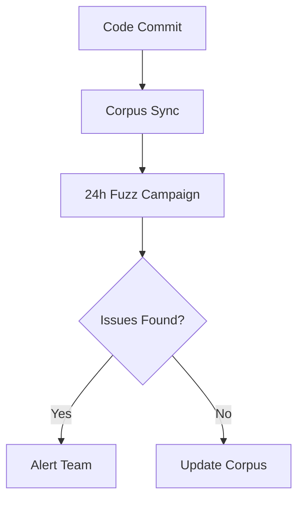

Internal Documentation for Staking Protocol Malo Labs Invariant Testing Suite
Malo Labs
Advanced Actor-Based Testing for Secure Staking Systems

Table of Contents
Running the Suite


Execution Modes

Configurations

Property Definitions

Invariants

Actor based Invariants

Postconditions

Global Postconditions (GPOST)

Handler-Specific Postconditions (HSPOST)

Handlers: Testing functions

Debugging Workflow

Logs output Analysis

Foundry Trace Reproduction

## CI Integration

## Corpus Management

## Continuous Fuzzing

Prerequisites
Toolchain Installation:

Foundry for local test execution

Echidna for property-based testing

Medusa for multi-agent fuzzing

Configuration:

Protocol deployment addresses

Predefined actor accounts 

Execution Modes
```css
Mode	           Purpose	               Command
Property	 Validate core invariants	make echidna
Assertion	 Verify postconditions	    make echidna-assert
Exploration	 Expand test coverage	    make medusa-explore
```
Configurations
Key parameters in malo_config.yaml:
```bash
testLimit: Maximum test sequences (default: 50,000)

seqLen: Operations per sequence (default: 200)

actors: List of test participant addresses

corpusDir: Coverage data storage path
```
##  Invariants

Properties that must hold across all protocol states.

```bash
Staking Balance Consistency: Total staked tokens must equal the sum of individual user balances.
```
## Reward Rate Boundaries:

Protocol reward rates must never exceed safe thresholds.

## Implementation Strategy:

Define mathematical relationships between protocol states

Implement checks using property-specific assertions

Validate across all actors and contract instances

Postconditions
State guarantees after specific operations.
```bash
Type	   Scope	                  Example
GPOST	Global State	    Total rewards ≤ Max supply
HSPOST	Operation-Specific	Withdraw amount ≤ User balance
```
Validation Workflow:

Capture pre-state values using _before hooks

Execute protocol operation

Verify post-state via _after checks

Handlers: Extending Protocol Coverage
Overview
Handlers act as middleware between test tooling and protocol contracts, enabling:

Realistic user behavior simulation

Precondition enforcement

State transition validation

Adding New Functions
Identify Target: Map new protocol functions to handler categories (user/permissioned/simulator)

Parameter Design:

Randomizable inputs

Bounded value ranges

Actor selection logic

Precondition Checks:

Balance/allowance validation

Protocol state requirements

Testing Process
Coverage Analysis: Review Medusa-generated HTML reports

Edge Case Injection:

Zero-value transactions

Max limit boundary tests

Postcondition Updates: Add operation-specific assertions

Debugging Workflow
Logging & Output


Failure Shrinking: Automated test case simplification

Artifact Storage:

Crash traces in /corpus/failures

Coverage data in /corpus/coverage

Foundry Reproduction
Trace Conversion: Use malo-trace-parser to convert Echidna outputs

Test Replay:

```bash
forge test --match-test testFailureCase -vvvvv  
```
State Inspection:

Pre/post-operation snapshots

Continuous Fuzzing

Pipeline Features:

Parallel test execution across 10+ workers

Automated corpus validation checks

Slack/Email alerts for property violations

Malo Labs © 2024 – Trust Through Rigorous Verification

This documentation provides clients and developers with a comprehensive understanding of our testing methodology while protecting intellectual property through abstraction of implementation details. For integration specifics, contact solutions@malolabs.xyz.